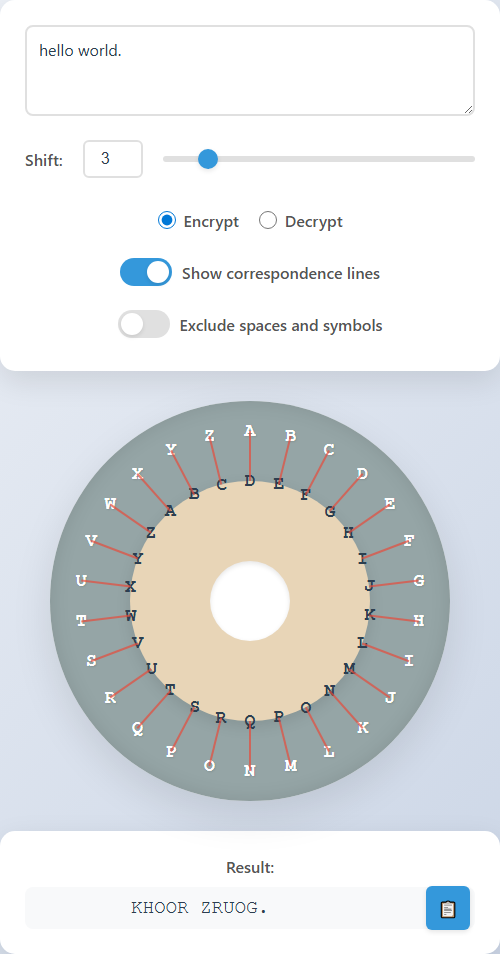
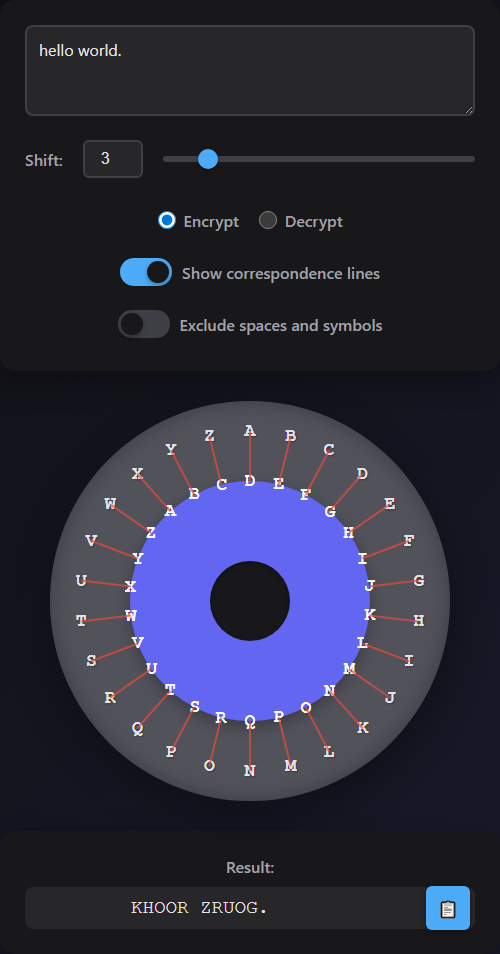

# Caesar Cipher Wheel Tool

English · [日本語](README.md)


[](https://ipusiron.github.io/caesar-cipher-wheel/)

**Day003 - 100 Security Tools with Generative AI**

A Caesar cipher (strictly, a shift cipher) that you turn by hand. Two rings sit one inside the other: the outer one holds the plaintext letters, the inner one the ciphertext. Turn the inner ring and you can see which letter becomes which, rather than being told.

---

## 🌐 Demo

👉 [https://ipusiron.github.io/caesar-cipher-wheel/](https://ipusiron.github.io/caesar-cipher-wheel/)

---

## 📸 Screenshots

> 
>
> *"hello world." encrypted with a shift of 3, showing the lines between the two rings*

> 
>
> *The same thing, following the OS dark setting*

---

## ✨ What it does

- **Converts as you type** — no button to press
- **A wheel you can read** — outer ring for plaintext, inner ring for ciphertext
- **Shift 0–25** — by slider or by number
- **Encrypt / decrypt** — switch between them
- **Correspondence lines** — draws which letter maps to which
- **Skip spaces and symbols** — output letters only
- **Copy the result** to the clipboard
- **Dark mode** — follows the OS, or switch it yourself; your choice is remembered
- **Letters stay upright** as the inner ring turns
- **Japanese and English** — the button at the top right, `?lang=en`, or your browser's setting

Letters are uppercased. Anything that is not a letter is left as it is, unless you turn on "Exclude spaces and symbols".

---

## 📖 How to use it

1. Type into the text area at the top.
2. Set the shift with the slider or the number box (0–25). The box may be left empty while you type; it is clamped when you leave it.
3. Choose **Encrypt** or **Decrypt**.
4. Turn on **Show correspondence lines** to see the mapping drawn on the wheel.
5. Turn on **Exclude spaces and symbols** to drop everything that is not a letter.
6. Press the copy button to take the result. Success and failure are announced to screen readers too.
7. The buttons at the top right switch the language and the theme.

### Examples

| Input | Shift | Mode | Exclude | Result |
| --- | ---: | --- | --- | --- |
| `hello world.` | 3 | encrypt | off | `KHOOR ZRUOG.` |
| `hello world.` | 3 | encrypt | on | `KHOORZRUOG` |
| `KHOOR ZRUOG.` | 3 | decrypt | off | `HELLO WORLD.` |
| `HELLO` | 13 | encrypt | off | `URYYB` |
| `xyz` | 3 | encrypt | off | `ABC` |

---

## 🔐 About the Caesar cipher

Suetonius, the Roman historian, records that Julius Caesar wrote to his friends in cipher while away in Gaul, to ask how politics stood at home.

Take a line from Caesar's own *Gallic Wars*:

> **Plaintext:** Gallia est omnis divisa in partes tres.
> ("All Gaul is divided into three parts")

With a shift of 3 it becomes:

> **Ciphertext:** JDOOLD HVW RPQLV GLYLVD LQ SDUWHV WUHV.

Classical Latin used 23 letters, without J, U or W. This tool uses the modern 26. ROT13 is this cipher with a shift of 13, which is why applying it twice gives back what you started with.

---

## ⚙️ How it is built

HTML5, CSS3 and plain JavaScript. No framework, no dependencies.

### The cipher

```javascript
function normalizeShift(shift) {
  const number = Number(shift);
  if (!Number.isFinite(number)) return 0;
  return ((Math.trunc(number) % 26) + 26) % 26;
}

function caesarShift(text, shift, { decrypt = false, excludeNonAlpha = false } = {}) {
  const source = excludeNonAlpha ? text.toUpperCase().replace(/[^A-Z]/g, '') : text.toUpperCase();
  const direction = decrypt ? -1 : 1;
  return source.replace(/[A-Z]/g, char => ALPHABET[(ALPHABET.indexOf(char) + direction * normalizeShift(shift) + 26) % 26]);
}
```

See [cipher.js](cipher.js) for the rest.

### Keeping the letters upright

As the inner ring turns, each letter is turned back by the same angle, so it stays readable.

```javascript
innerRing.style.transform = `rotate(${angle}deg)`;
innerLetters.forEach(letter => {
  letter.style.transform = `rotate(${-angle}deg)`;
});
```

---

## 🧪 Tests

```bash
npm test
```

Node's own test runner, on Node.js 22 or later. No dependencies. GitHub Actions runs the same tests on every push and pull request.

The tests cover the cipher itself, the examples in this README, the image references, and the static accessibility and security conditions in the HTML — including that the Japanese and English dictionaries hold the same keys, and that every key the page asks for exists.

---

## 🎯 Use cases

### Ways of using this tool in particular

- Confirming the modular arithmetic where a full turn returns to the start (math and clock classes): encrypting HELLO with a shift of 3 gives KHOOR, and a shift of 26 returns HELLO. Turning the wheel once around (26) comes back to the start, the same modular arithmetic as the 12 hours of a clock. You can confirm, by turning the wheel, that a shift beyond 26 is decided by the remainder when divided by 26
- Confirming that only a shift of 13 makes encryption and decryption the same (ROT13 and involution classes): encrypting text with a shift of 13 and then encrypting it again with a shift of 13 returns the original, because 13 twice is 26 and comes around once. You can confirm that 13 is the only shift that is its own inverse (ROT13)
- Confirming that encryption and decryption turn opposite ways (the basics of the cipher): text encrypted with a shift of 3 returns with a shift of 3 in decrypt mode (the opposite way). Turning the wheel right 3 is undone by turning left 3. You can confirm, by the rotation, that encryption and decryption go in opposite directions

### General uses

- Learn how a Caesar cipher works in class or self-study while turning the wheel
- Make a simple cipher keyed by the shift amount for puzzles and games
- Exchange cipher letters with children as play (not for protecting secrets)

## 🔒 Privacy

Nothing is sent anywhere, and nothing you type is stored. The only things kept in `localStorage` are your theme and language. The page carries a Content Security Policy and a `no-referrer` referrer policy.

---

## ♿ Accessibility

The toggles, the radio buttons, copy, theme and language are all reachable by keyboard. The wheel itself is hidden from screen readers as decoration; the current shift and mapping are announced in text instead. Transitions are suppressed when `prefers-reduced-motion` is set.

---

## 📚 Further reading

Books the author was involved in (in Japanese):

- [『暗号技術のすべて』](https://akademeia.info/?page_id=157) pp. 34–40
- [『シーザー暗号の解読法』](https://akademeia.info/?page_id=37037)
- [『Pythonでいかにして暗号を破るか』](https://akademeia.info/?page_id=94) ch. 5, pp. 87–105
- [『安全な暗号をどう実装するか』](https://book.mynavi.jp/ec/products/detail/id=147364) p. 5

---

## 📁 Layout

```text
caesar-cipher-wheel/
├── .github/workflows/test.yml  # CI on Node.js 22
├── assets/                     # screenshots
├── test/
│   ├── cipher.test.js          # the cipher itself
│   ├── html.test.js            # static checks on the HTML
│   ├── i18n.test.js            # the Japanese and English dictionaries
│   └── readme.test.js          # the examples and image references
├── cipher.js                   # the cipher, with no DOM
├── i18n.js                     # Japanese and English text
├── index.html
├── script.js                   # drawing and events
├── style.css
└── package.json                # test command only
```

`index.html` works when opened directly through `file://`. Node.js 22 or later is needed for the tests.

---

## 📄 License

MIT License — see [LICENSE](./LICENSE).

---

## 🛠️ About this project

This tool is part of **100 Security Tools with Generative AI**, in which one security-related tool is built and published each day with the help of generative AI.

🔗 [https://akademeia.info/?page_id=42163](https://akademeia.info/?page_id=42163)
