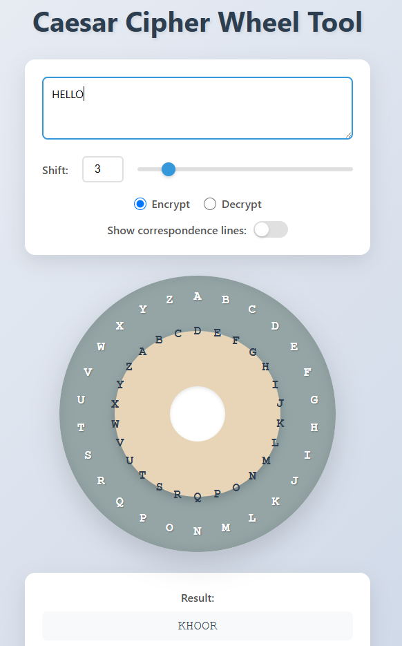

# シーザー暗号円盤ツール（Caesar Cipher Wheel Tool）

**Day 3 - 生成AIで作るセキュリティツール100**

インタラクティブなシーザー暗号（厳密にはシフト暗号）の暗号化・復号ツールです。
視覚的な暗号円盤インターフェースで暗号化の仕組みを直感的に理解できます。

円盤の回転により、平文と暗号文の対応関係が一目で分かる教育的なツールとなっています。

## デモページ

👉 [https://ipusiron.github.io/caesar-cipher-wheel/](https://ipusiron.github.io/caesar-cipher-wheel/)

---

## サンプル画面

> 以下は実際の画面例です（GitHub Pages上の表示例）  
>
> 

## 機能

- **リアルタイム暗号化/復号**: テキストを入力すると即座に結果が表示されます
- **視覚的な円盤インターフェース**: 
  - 外側の円盤：固定されたアルファベット（グレー）。平文文字。
  - 内側の円盤：回転可能なアルファベット（ベージュ）。暗号文文字。
- **シフト値の調整**: 0〜25の範囲でシフト値を設定可能
  - スライダーによる直感的な操作
  - 数値入力による正確な設定
- **暗号化/復号モード切替**: ラジオボタンで簡単に切り替え
- **文字の正立維持**: 内側の円盤が回転しても、各文字は常に読みやすい向きを保持
- **レスポンシブデザイン**: モバイルデバイスでも快適に使用可能

## 使い方

1. **テキスト入力**: 上部のテキストエリアに暗号化/復号したいメッセージを入力する。
2. **シフト値設定**: スライダーまたは数値入力でシフト値（0-25）を設定する。
3. **モード選択**: 
   - 「Encrypt」: 暗号化モード。テキスト入力欄に「平文」を入力する。
   - 「Decrypt」: 復号モード。テキスト入力欄に「暗号文」を入力する。
4. **結果確認**: 下部の結果表示エリアに変換後のテキストが表示される。

## 技術仕様

### 使用技術
- HTML5
- CSS3（アニメーション、グラデーション、レスポンシブデザイン）
- Vanilla JavaScript（フレームワーク不使用）

### ブラウザー対応
- Chrome（推奨）
- Firefox
- Safari
- Edge
- モバイルブラウザー

### 主要な実装詳細

#### シーザー暗号アルゴリズム
```javascript
function caesarCipher(text, shift, decrypt = false) {
  return text.toUpperCase().replace(/[A-Z]/g, c => {
    const index = alphabet.indexOf(c);
    if (index === -1) return c;
    const offset = decrypt ? (index - shift + 26) % 26 : (index + shift) % 26;
    return alphabet[offset];
  });
}
```

#### 文字の正立維持
内側の円盤が回転する際、各文字要素に逆回転を適用することで、文字が常に正しい向きを保ちます。

```javascript
innerRing.style.transform = `rotate(${angle}deg)`;
innerLetters.forEach(letter => {
  letter.style.transform = `rotate(${-angle}deg)`;
});
```

## デザインの特徴

- **モダンなUI**: グラデーション背景とカード型のコントロールパネル
- **視覚的階層**: 色分けされた円盤で内側と外側を明確に区別
- **スムーズなアニメーション**: cubic-bezier関数による自然な動き
- **アクセシビリティ**: 高コントラストで読みやすいフォント

## カスタマイズ

### 色の変更
CSSの以下の部分を編集して配色を変更できます。

- `.outer-ring-bg`: 外側円盤の背景色
- `.inner-ring-bg`: 内側円盤の背景色
- `body`: 背景のグラデーション

### サイズの調整
`.disk-container`のwidth/heightを変更して円盤のサイズを調整できます。

## ライセンス

このプロジェクトは[MITライセンス](./LICENSE)の下で公開されています。

## 🔗 関連リンク

- [『暗号技術のすべて』](https://akademeia.info/?page_id=157) P.34-40
- [『シーザー暗号の』](https://akademeia.info/?page_id=37037)
- [『Pythonでいかにして暗号を破るか　古典暗号解読プログラムを自作する本』](https://akademeia.info/?page_id=94) 第5章 P.87-105
- [『安全な暗号をどう実装するか 暗号技術の新設計思想』](https://book.mynavi.jp/ec/products/detail/id=147364) P.5

## このツールについて

本ツールは、「生成AIで作るセキュリティツール100」プロジェクトの一環として開発されました。 このプロジェクトでは、AIの支援を活用しながら、セキュリティに関連するさまざまなツールを100日間にわたり制作・公開していく取り組みを行っています。

プロジェクトの詳細や他のツールについては、以下のページをご覧ください。

🔗 [https://akademeia.info/?page_id=42163](https://akademeia.info/?page_id=42163)
