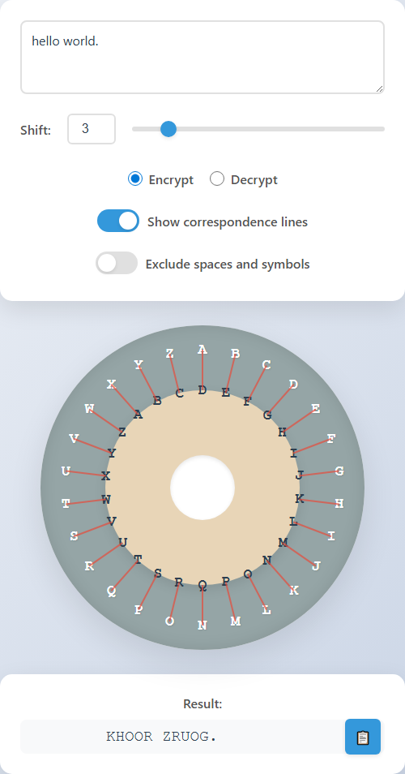
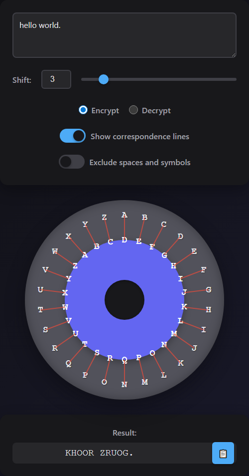

<!--
---
id: day003
slug: caesar-cipher-wheel

title: "Caesar Cipher Wheel Tool"

subtitle_ja: "視覚的な暗号円盤でシーザー暗号を学ぶ"
subtitle_en: "Learn Caesar cipher with a visual cipher disk"

description_ja: "インタラクティブなシーザー暗号（シフト暗号）の暗号化・復号ツール。視覚的な暗号円盤インターフェイスで暗号化の仕組みを直感的に理解できます。"
description_en: "Interactive Caesar cipher encryption/decryption tool with a visual cipher disk interface for intuitive understanding of encryption."

category_ja:
  - 古典暗号
  - 換字式暗号
category_en:
  - Classical Cryptography
  - Substitution Cipher

difficulty: 1

tags:
  - caesar-cipher
  - shift-cipher
  - substitution-cipher
  - encryption
  - decryption
  - cryptography
  - visualization
  - educational

repo_url: "https://github.com/ipusiron/caesar-cipher-wheel"
demo_url: "https://ipusiron.github.io/caesar-cipher-wheel/"

hub: true
---
-->

# Caesar Cipher Wheel Tool - シーザー暗号円盤ツール


[](https://ipusiron.github.io/caesar-cipher-wheel/)

**Day003 - 生成AIで作るセキュリティツール100**

インタラクティブなシーザー暗号（厳密にはシフト暗号）の暗号化・復号ツールです。視覚的な暗号円盤インターフェイスで、文字の対応関係を確認しながら仕組みを学べます。

---

## 🌐 デモページ

👉 [https://ipusiron.github.io/caesar-cipher-wheel/](https://ipusiron.github.io/caesar-cipher-wheel/)

ブラウザーで直接お試しいただけます。

---

## 📸 スクリーンショット

以下はGitHub Pagesのデモページの表示です。

> 
>
> *ライトテーマで「hello world.」をシフト3で暗号化し、文字の対応線を表示した画面*

> 
>
> *OSのダーク設定を反映した同じ暗号化状態の画面*

---

## ✨ 機能

- **リアルタイム暗号化・復号**：テキスト入力に応じた即時変換
- **視覚的な円盤インターフェイス**：外側の平文文字と内側の暗号文文字による対応関係の表示
- **シフト値の調整**：0〜25のスライダーと数値入力
- **暗号化・復号モードの切替**：ラジオボタンによる操作
- **対応線の表示**：外側と内側の文字の対応を線で提示
- **空白と記号の除外**：英字だけを出力する切替
- **結果のコピー**：変換結果をクリップボードへコピー
- **ダークモード**：OS設定への追従、ボタンでの切替、選択の保存
- **文字の正立維持**：内側の円盤が回転しても読みやすい向きを保持
- **出力の扱い**：英字は大文字に統一し、英字以外はそのまま残す。除外ONのときは英字以外を取り除く
- **レスポンシブデザイン**：モバイルブラウザーでの利用

---

## 📖 使い方

1. **テキスト入力**：上部のテキストエリアに暗号化・復号したいメッセージを入力します。
2. **シフト値設定**：スライダーまたは数値入力でシフト値（0〜25）を設定します。数値入力欄は一度空にでき、確定時に範囲内へ調整されます。
3. **モード選択**：「Encrypt」で平文を暗号化し、「Decrypt」で暗号文を復号します。
4. **対応線の確認**：「Show correspondence lines」をONにすると、円盤上の文字の対応を線で確認できます。
5. **記号の扱い**：「Exclude spaces and symbols」をONにすると、空白・数字・記号などを出力から除外します。
6. **結果のコピー**：コピーのボタンを押すと、変換結果をコピーします。成功または失敗は画面とスクリーンリーダーに通知されます。
7. **テーマ切替**：右上のボタンでライト・ダークテーマを切り替えます。選択しない場合はOS設定に従います。

### 使い方の例

| 入力 | シフト | モード | 除外 | 結果 |
| --- | ---: | --- | --- | --- |
| `hello world.` | 3 | 暗号化 | OFF | `KHOOR ZRUOG.` |
| `hello world.` | 3 | 暗号化 | ON | `KHOORZRUOG` |
| `KHOOR ZRUOG.` | 3 | 復号 | OFF | `HELLO WORLD.` |
| `HELLO` | 13 | 暗号化 | OFF | `URYYB` |
| `xyz` | 3 | 暗号化 | OFF | `ABC` |

---

## 🔐 シーザー暗号について

### 📜 歴史的背景

古代ローマの歴史家スエトニウスは、ユリウス・カエサルが、本国の政治情勢を問い合わせるために遠隔地のガリアから友人に暗号の手紙を出したことを伝えています。

### 暗号化の例

カエサルの『ガリア戦記』の一節には、以下の文（ラテン語）があります。

> 【平文】Gallia est omnis divisa in partes tres.
> 「ガリア全体は三つの部分に分かれている」

この文を平文として、シーザー暗号で暗号化すると以下の暗号文が得られます。

> 【暗号文】JDOOLD HVW RPQLV GLYLVD LQ SDUWHV WUHV.

古典ラテン語のアルファベットはJ・U・Wのない23文字ですが、本ツールでは現代の26文字のアルファベットとして扱います。ROT13はシフト13の方式であり、同じ変換を2回適用すると元の文字列に戻ります。

---

## ⚙️ 技術仕様

### 🛠️ 使用技術

- HTML5
- CSS3（アニメーション、グラデーション、レスポンシブデザイン）
- Vanilla JavaScript（フレームワーク不使用）

### 🌏 ブラウザー対応

- Chrome（推奨）
- Firefox
- Safari
- Edge
- モバイルブラウザー

### 💻 主要な実装詳細

#### シーザー暗号アルゴリズム

```javascript
function normalizeShift(shift) {
  const number = Number(shift);
  if (!Number.isFinite(number)) return 0;
  return ((Math.trunc(number) % 26) + 26) % 26;
}

function caesarShift(text, shift, { decrypt = false, excludeNonAlpha = false } = {}) {
  const source = excludeNonAlpha ? text.toUpperCase().replace(/[^A-Z]/g, '') : text.toUpperCase();
  const direction = decrypt ? -1 : 1;
  return source.replace(/[A-Z]/g, char => ALPHABET[(ALPHABET.indexOf(char) + direction * normalizeShift(shift) + 26) % 26]);
}
```

実装の全体は[cipher.js](cipher.js)を参照してください。

#### 文字の正立維持

内側の円盤が回転する際、各文字要素に逆回転を適用することで、文字が常に正しい向きを保ちます。

```javascript
innerRing.style.transform = `rotate(${angle}deg)`;
innerLetters.forEach(letter => {
  letter.style.transform = `rotate(${-angle}deg)`;
});
```

---

## 🧪 テスト

`npm test`でNode.js標準の`node --test`を実行します。Node.js 22以上で動作し、追加の依存パッケージはありません。GitHub Actionsではpushとpull requestごとに同じテストを実行します。

テストは暗号処理だけでなく、READMEの暗号化の例と使い方の例の表、画像参照、HTMLの静的なアクセシビリティ・セキュリティ条件も照合します。

---

## 🔒 セキュリティ・プライバシー

通信は行わず、入力したテキストも保存しません。localStorageに保存するのはライト・ダークテーマの選択だけです。HTMLにはContent Security Policyと`no-referrer`のreferrerポリシーを設定しています。

---

## ♿ アクセシビリティ

チェックボックスのトグル、ラジオボタン、コピー、テーマ切替はキーボードで操作できます。円盤は視覚表現として隠し、現在のシフトと文字対応をスクリーンリーダー向けに通知します。`prefers-reduced-motion`が有効な環境では回転などの遷移を抑制します。

---

## 🎨 デザインの特徴

- **モダンなUI**：グラデーション背景とカード型のコントロールパネル
- **視覚的階層**：色分けされた円盤による内側と外側の区別
- **スムーズなアニメーション**：cubic-bezier関数による自然な動き
- **アクセシビリティ**：高コントラストで読みやすいフォント

---

## 🔧 カスタマイズ

### 🎨 色の変更

CSSの以下の部分を編集して配色を変更できます。

- `.outer-ring-bg`：外側円盤の背景色
- `.inner-ring-bg`：内側円盤の背景色
- `body`：背景のグラデーション

### 📐 サイズの調整

`.disk-container`のwidthとheightを変更して円盤のサイズを調整できます。

---

## 📚 参考資料・文献

### 📖 私が関与した書籍

- [『暗号技術のすべて』](https://akademeia.info/?page_id=157) P.34-40
- [『シーザー暗号の解読法』](https://akademeia.info/?page_id=37037)
- [『Pythonでいかにして暗号を破るか　古典暗号解読プログラムを自作する本』](https://akademeia.info/?page_id=94) 第5章 P.87-105
- [『安全な暗号をどう実装するか 暗号技術の新設計思想』](https://book.mynavi.jp/ec/products/detail/id=147364) P.5

---

## 📁 ディレクトリー構造

```text
caesar-cipher-wheel/
├── .github/
│   └── workflows/
│       └── test.yml       # Node.js 22で実行するCI
├── assets/
│   ├── screenshot.png     # ライトテーマのスクリーンショット
│   └── screenshot2.png    # ダークテーマのスクリーンショット
├── test/
│   ├── cipher.test.js     # 暗号ロジックの単体テスト
│   ├── html.test.js       # HTMLの静的検証
│   └── readme.test.js     # READMEの例と画像参照の検証
├── cipher.js              # DOMに依存しないシーザー暗号ロジック
├── index.html             # ツールのHTML構造
├── script.js              # 画面の描画とイベント処理
├── style.css              # レスポンシブデザインとテーマ
├── package.json           # 依存なしのテストコマンド
├── README.md              # 本ドキュメント
├── LICENSE                # MITライセンス
└── sample.png             # 旧スクリーンショット（参照なし）
```

## 💻 動作環境

モダンブラウザーで動作します。`index.html`は`file://`で直接開いても利用できます。テストにはNode.js 22以上が必要です。

---

## 📄 ライセンス

このプロジェクトは[MITライセンス](./LICENSE)の下で公開されています。

---

## 🛠️ このツールについて

本ツールは、「生成AIで作るセキュリティツール100」プロジェクトの一環として開発されました。このプロジェクトでは、AIの支援を活用しながら、セキュリティに関連するさまざまなツールを100日間にわたり制作・公開していく取り組みを行っています。

プロジェクトの詳細や他のツールについては、以下のページをご覧ください。

🔗 [https://akademeia.info/?page_id=42163](https://akademeia.info/?page_id=42163)
